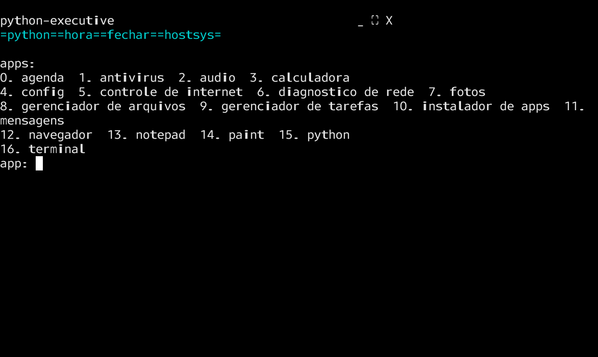
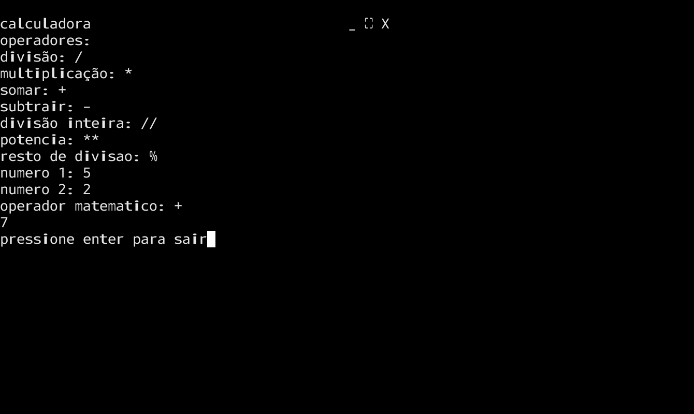
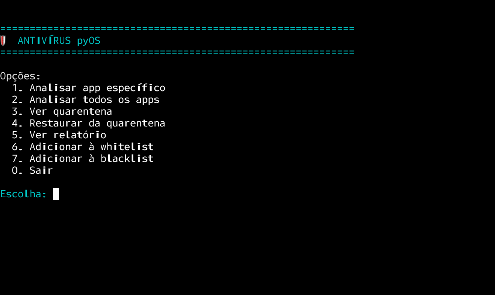
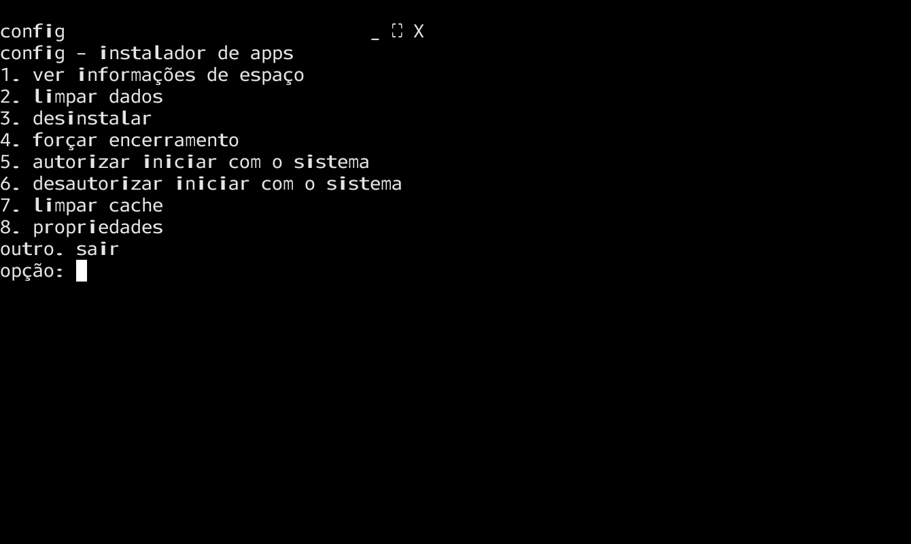

# 💻 pyOS
o sistema está sobe licença MIT
## 🔍 objetivo:
- 1. ser um sistema que roda dentro de outro
- 2. deixar sistemas operacionais com só terminal mais amigável

**o python mínimo compatível é 3.6, use python 3.6 ou superior**

## links:
### python:
- [python.org](https://python.org)
### git:
- [pyOS](https://github.com/Miguel2729/pyOS.git)

## ⚙️ funcionalidades:
| funcionalidade/grupo de funcionalidades | descrição/mais informações |
| --------------------------------------- | -------------------------- |
| apps | terminal, gerenciador de tarefas, gerenciador de arquivos, calculadora, notepad, appsInstalados, navegador, mensagens, gerenciador de tarefas, fotos, etc..., também pode instalar apps |
| sistema | processos em background, funções(hora, fechar, Python, hostsys) |
| interface | interface gráfica baseada em texto sem ser só CLI, compatível com terminal e ide |

## 🔴🟡🟢 consumo de ram aproximado:
| ação | consumo aproximado |
| ---------------------- | --------------- |
| em repouso | **90-160 MB** |
| com 1-2 apps abertos | **160-280 MB** |
| com vários apps abertos + navegador | **280-550 MB** |
| máximo | **400-650 MB** |
| uso normal | **220-380 MB** |

## 📥 instalação rápida:
```bash
# instalar pacotes
apt install git
apt install python3

# clonar os arquivos
git clone https://github.com/Miguel2729/pyOS.git

# acessar a pasta
cd pyOS
# executar o pyOS
python3 pyOS.py
```
## ❓️ porque usar pyOS?:
- apenas 512 MB de ram para experiência boa o pyOS precisa(no momento(5.15)
- não é só CLI
- tem interface gráfica baseada em texto
- funciona em sistemas operacionais com só terminal, terminal normal e ide
- também pode ser usado para fins educacionais(mais não é o objetivo)
- você pode usar ele se o sistema operacional é só o terminal e você não sabe os comandos
### 🆚️ sem pyOS vs com pyOS:
| sem pyOS | com pyOS |
| ---- | ---- |
| só terminal | mais amigável
| difícil de usar | fácil de usar
### 📺 interface do pyOS copiada e colada:
```text
python-executive                 _ ⛶ X
=python==hora==fechar==hostsys=

apps:
calculadora  notepad  config
terminal  gerenciador de arquivos  appsInstalados
navegador  gerenciador de tarefas
app:
```
## 🖼 fotos:
   

## 🚫 o que o pyOS NÃO é:
- um sistema independente
- um sistema que funciona como sistema real
- um terminal CLI
- uma distro Linux
- um kernel
- um shell
- um pacote
- um sistema operacional de código fechado
- um emulador
- um app de máquina virtual
- um framework
- uma biblioteca python
- uma simulação

## ✅️ o que é?
- uma interface gráfica baseada em texto que roda por cima do terminal sem precisar decorar comandos e que tem algumas(algumas  não todas) funcionalidades de SO

## dependências do pyOS
| dependência | porque? | tipo de dependência |
| ----------------------------------- | ----------------------------------------------------- | ------------------- |
| python 3.6 ou superior | algumas funcionalidades não funcionam se for uma versão inferior ou pode dar erros inesperados | obrigatório |
| sistema operacional com portaudio.h | para os sistemas baseados no pyOS e apps customizados conseguirem usar a entrada de voz | opcional |
| PIL para python | para o gerador de imagens ascii funcionar | opcional |
| git | se for instalar apps como repositório github no pyOS, isso é nessesario | opcional |
| no mínimo 256 MB de ram | para o sistema funcionar normalmente mais e recomendado 512 MB ou mais para não travar | obrigatório |
| sistema hospedeiro | o pyOS não é independente | obrigatório |
| PIL para python | para o app "fotos" funcionar | opcional |

## 🔄 Terminal Integrado - Por que não é redundante?

O pyOS inclui um terminal **com propósito específico**:

### 🎯 **Não é "mais um terminal" - é uma "porta segura" para o shell!**

| pyOS Terminal | Terminal Host Convencional |
|---------------|----------------------------|
| ✅ **Navegação controlada** - Acessa qualquer diretório (exceto sensíveis) | ⚠️ **Acesso total** - Inclusive a áreas críticas do sistema |
| ✅ **Comandos úteis liberados** - `cd`, `ls`, `python -m http.server`, etc. | ⚠️ **Todos os comandos** - Inclusive os perigosos |
| 🛡️ **Proteção automática** - Bloqueia comandos perigosos | ❌ **Sem proteção** - Usuário assume todos os riscos |
| 🔄 **Volta fácil** - Terminal host sempre disponível quando precisar | 🔒 **Única opção** - Se errar, pode danificar o sistema |

### 💡 **Como funciona na prática:**
- **No pyOS**: Digite `terminal` → Use com segurança → Volte ao menu principal
- **Fora do pyOS**: Use o terminal convencional quando precisar de total controle
- **Sair do Terminal**: Digite quit como comando no terminal

### 🎮 **Perfect para:**
- **Iniciantes** que estão aprendendo comandos
- **Uso rápido** sem risco de acidentes  
- **Situações educacionais** onde segurança é prioritária

🔐 **Segurança + Liberdade = Você escolhe quando precisa de cada uma!**

⌨️ **os comandos são os mesmos do sistema operacional hospeiro, se for Windows vai usar comandos de Windows se for Linux vai usar comandos de Linux**

## porque o menu principal fala python-executive e não pyOS? 
- pyOS fica muito cru
- python-executive foi inspirado no MS-DOS executive do Windows 1.0
- não é recomendado chamar o pyOS de python-executive porque esse não nem seu apelido, nem nome e nem segundo nome, pyOS é mais preciso 

## terminal puro vs pyOS vs shell gráfico
| Feature | Terminal Puro | pyOS | GUI Completa |
|---------|---------------|------|--------------|
| **Facilidade de uso** | ❌ Difícil | ✅ **Fácil** | ✅ Fácil |
| **Requisitos sistema** | ✅ Mínimos | ✅ **Mínimos** | ❌ Altos |
| **Instalação** | ✅ Já incluso | ✅ **Simples** | ⚠️ Complexa |
| **Estabilidade** | ✅ Máxima | ✅ **Alta** | ⚠️ Variável |

## aviso importante 
pyOS não é um sistema operacional simulado e não tem essa intenção, ele é um tui que facilita o uso do Linux sem gui, pyOS é um nome dado porque ele tenta parecer um sistema operacional para ser mais amigável 
