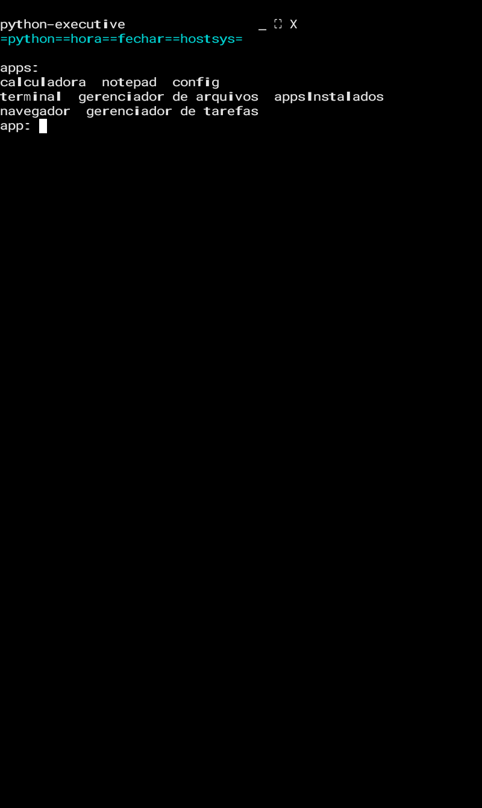
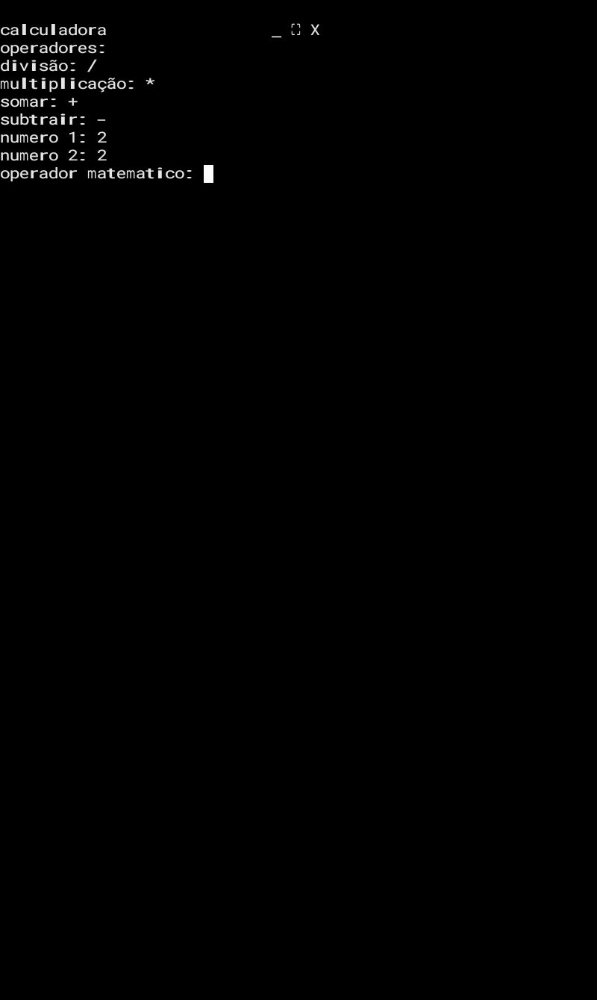
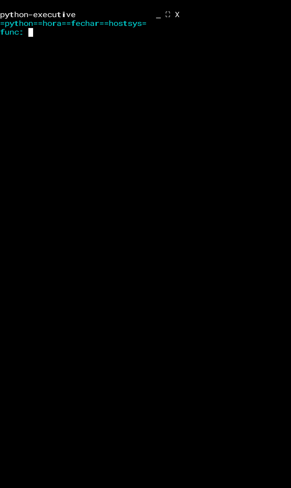

# 💻 pyOS
## 🔍 objetivo:
- 1. ser um sistema que roda dentro de outro
- 2. deixar sistemas operacionais com só terminal mais amigável

**o python mínimo compatível é 3.6, use python 3.6 ou superior**

## links:
### python:
- [python.org](https://python.org)
### git:
- [pyOS](https://github.com/Miguel2729/pyOS.git)

## ⚙️ funcionalidades:
| funcionalidade/grupo de funcionalidades | descrição/mais informações |
| --------------------------------------- | -------------------------- |
| apps | terminal, gerenciador de tarefas, gerenciador de arquivos, calculadora, notepad, appsInstalados, também pode instalar apps |
| sistema | processos em background, funções(hora, fechar, Python, hostsys) |
| interface | interface gráfica baseada em texto sem ser só CLI, compatível com terminal d ide |

## 🔴🟡🟢 consumo de ram aproximado:
| ação | consumo |
| ---------------------- | -------
| em repouso | 80-150 MB |
| com 1-2 apps abertos | 150-250 MB |
| com vários apps abertos + navegador | 250-400 MB |
| máximo | 400-600 MB |
| uso normal | 200-300 MB |

## 📥 instalação rápida:
```bash
# instalar pacotes
apt install git
apt install python3

# clonar os arquivos
git clone https://github.com/Miguel2729/pyOS.git

# acessar a pasta
cd pyOS
# executar o pyOS
python3 pyOS.py
```
## ❓️ porque usar pyOS?:
- apenas 512 MB de ram para experiência boa o pyOS precisa(no momento(5.15)
- não é só CLI
- tem interface gráfica baseada em texto
- funciona em sistemas operacionais com só terminal, terminal normal e ide
- também pode ser usado para fins educacionais
- você pode usar ele se o sistema operacional é só o terminal e você não sabe os comandos
### 🆚️ sem pyOS vs com pyOS:
| sem pyOS | com pyOS |
| ---- | ---- |
| só terminal | mais amigável
| difícil de usar | fácil de usar
### 📺 interface do pyOS copiada e colada:
```text
python-executive                 _ ⛶ X
=python==hora==fechar==hostsys=

apps:
calculadora  notepad  config
terminal  gerenciador de arquivos  appsInstalados
navegador  gerenciador de tarefas
app:
```
## 🖼 fotos:
   
