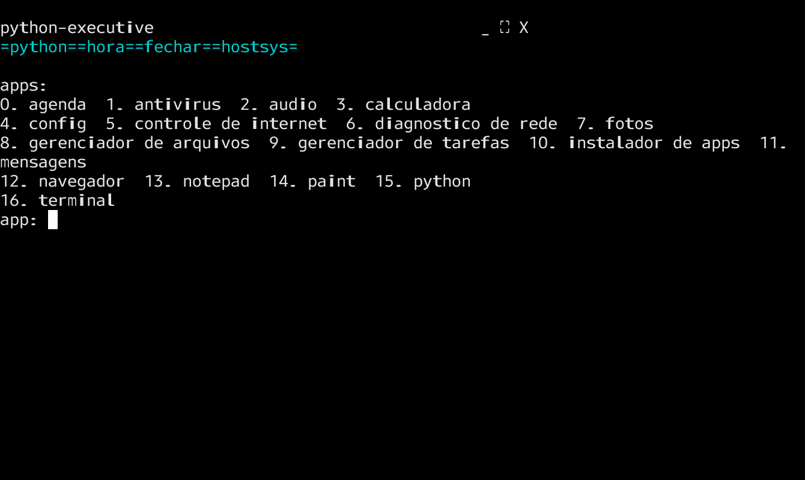
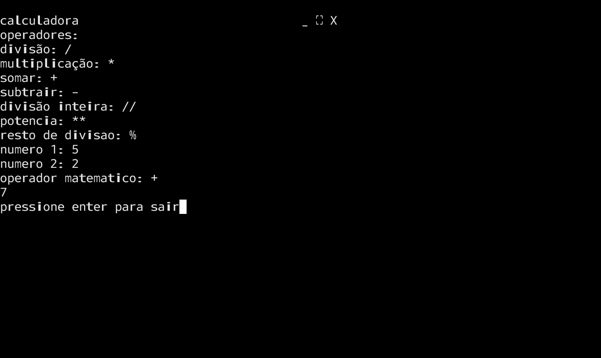
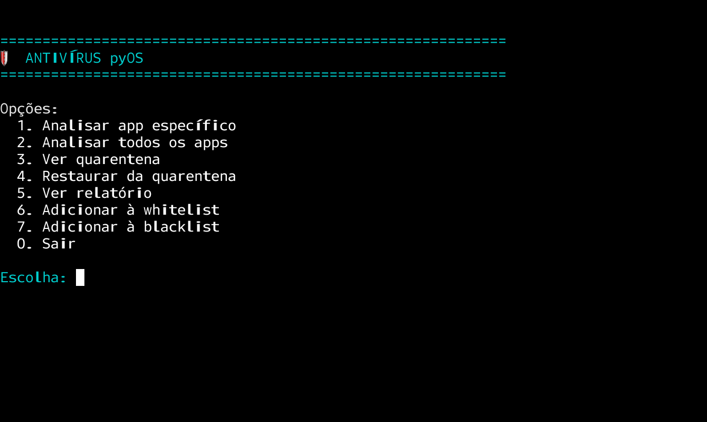
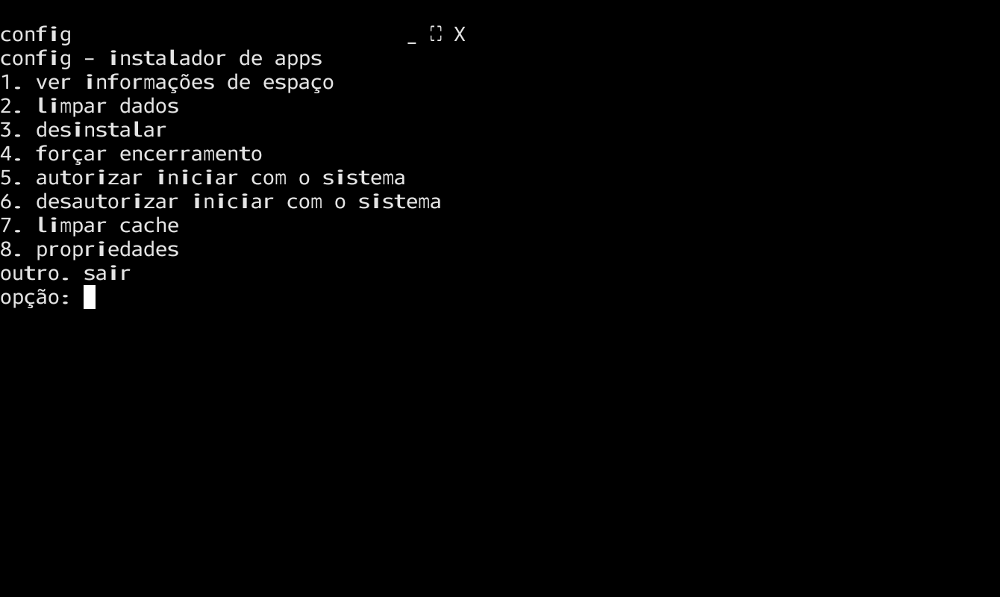

# 💻 pyOS
o sistema está sob licença MIT

## 🔍 objetivo:
- 1. deixar sistemas operacionais com só terminal mais amigável

**o python mínimo compatível é 3.8, use python 3.8 ou superior**

## links:
### python:
- [python.org](https://python.org)
### git:
- [pyOS git](https://github.com/Miguel2729/pyOS.git)

## ⚙️ funcionalidades:
| funcionalidade/grupo de funcionalidades | descrição/mais informações |
| --------------------------------------- | -------------------------- |
| apps | agenda, antivirus, audio, calculadora, config, controle de internet, diagnostico de rede, fotos, gerenciador de arquivos, gerenciador de tarefas, mensagens, navegador, notepad, paint, python, terminal |
| sistema | processos em background, funções (hora, fechar, python, hostsys), gerenciador de discos (dentro do config) |
| interface | interface gráfica baseada em texto sem ser só CLI, menu com números para acesso rápido |

## ❓️ porque usar pyOS?:
- recomendado 1 GB de ram para usar todos os apps sem travamentos
- não é só CLI
- tem interface gráfica baseada em texto
- funciona em sistemas operacionais com só terminal, terminal normal e IDE
- você pode usar ele se o sistema operacional é só o terminal e você não sabe os comandos

### 🆚️ sem pyOS vs com pyOS:
| sem pyOS | com pyOS |
| ---- | ---- |
| só terminal | mais amigável |
| difícil de usar | fácil de usar |

### 📺 interface do pyOS copiada e colada:
%%%text
python-executive                  _ ⛶ X
=python==hora==fechar==hostsys=

apps:
0. agenda          1. antivirus       2. audio           3. calculadora
4. config          5. controle de internet  6. diagnostico de rede
7. fotos           8. gerenciador de arquivos  9. gerenciador de tarefas
10. mensagens      11. navegador       12. notepad        13. paint
14. python         15. terminal
app:
%%%

## 🖼 fotos:
   

## 🚫 o que o pyOS NÃO é:
- um sistema independente
- um sistema que funciona como sistema real
- um terminal CLI
- uma distro Linux
- um kernel
- um shell
- um pacote
- um sistema operacional de código fechado
- um emulador
- um app de máquina virtual
- um framework
- uma biblioteca python
- uma simulação

## ✅️ o que é?
- uma interface gráfica baseada em texto que roda por cima do terminal sem precisar decorar comandos e que tem algumas (algumas não todas) funcionalidades de SO

## dependências do pyOS
| dependência | porque? | tipo de dependência |
| ----------------------------------- | ----------------------------------------------------- | ------------------- |
| python 3.8 ou superior | algumas funcionalidades não funcionam se for uma versão inferior ou pode dar erros inesperados | obrigatório |
| colorama | para cores na interface | obrigatório (instala automaticamente) |
| requests | para o navegador e downloads | obrigatório (instala automaticamente) |
| sistema hospedeiro | o pyOS não é independente | obrigatório |
| no mínimo 1 GB de ram | para o sistema funcionar sem travamentos com todos os apps | obrigatório |
| PIL (Pillow) | para os apps fotos e paint | opcional |
| pyaudio | para o app de áudio | opcional |
| beautifulsoup4 | para renderização HTML no navegador | opcional |
| speechrecognition | para entrada de voz no app audio | opcional |

## 🔄 Terminal Integrado - Por que não é redundante?

O pyOS inclui um terminal **com propósito específico**:

### 🎯 **Não é "mais um terminal" - é uma "porta segura" para o shell!**

| pyOS Terminal | Terminal Host Convencional |
|---------------|----------------------------|
| ✅ **Navegação controlada** - Acessa qualquer diretório (exceto sensíveis) | ⚠️ **Acesso total** - Inclusive a áreas críticas do sistema |
| ✅ **Comandos úteis liberados** - cd, ls, python -m http.server, etc. | ⚠️ **Todos os comandos** - Inclusive os perigosos |
| 🛡️ **Proteção automática** - Bloqueia comandos perigosos | ❌ **Sem proteção** - Usuário assume todos os riscos |
| 🔄 **Volta fácil** - Digite quit para voltar ao pyOS | 🔒 **Única opção** - Se errar, pode danificar o sistema |

### 💡 **Como funciona na prática:**
- **No pyOS**: Digite terminal → Use com segurança → Digite quit para voltar
- **Fora do pyOS**: Use o terminal convencional quando precisar de total controle

### 🎮 **Perfect para:**
- **Iniciantes** que estão aprendendo comandos
- **Uso rápido** sem risco de acidentes  
- **Situações educacionais** onde segurança é prioritária

🔐 **Segurança + Liberdade = Você escolhe quando precisa de cada uma!**

⌨️ **os comandos são os mesmos do sistema operacional hospedeiro, se for Windows vai usar comandos de Windows se for Linux vai usar comandos de Linux**

## porque o menu principal fala python-executive e não pyOS? 
- pyOS fica muito cru
- python-executive foi inspirado no MS-DOS executive do Windows 1.0
- não é recomendado chamar o pyOS de python-executive porque esse não é nem seu apelido, nem nome e nem segundo nome, pyOS é mais preciso 

## terminal puro vs pyOS vs shell gráfico
| Feature | Terminal Puro | pyOS | GUI Completa |
|---------|---------------|------|--------------|
| **Facilidade de uso** | ❌ Difícil | ✅ **Fácil** | ✅ Fácil |
| **Requisitos sistema** | ✅ Mínimos | ✅ **Mínimos** | ❌ Altos |
| **Instalação** | ✅ Já incluso | ✅ **Simples** | ⚠️ Complexa |
| **Estabilidade** | ✅ Máxima | ✅ **Alta** | ⚠️ Variável |

## aviso importante 
pyOS não é um sistema operacional simulado e não tem essa intenção, ele é um tui que facilita o uso do Linux sem gui, pyOS é um nome dado porque ele tenta parecer um sistema operacional para ser mais amigável 

# Aplicativos (16 apps)

| Nº | App | Descrição |
|----|-----|-----------|
| 0 | agenda | Gerenciador de eventos e lembretes |
| 1 | antivirus | Analisa apps em busca de código malicioso |
| 2 | audio | Grava e reproduz áudio (formato WAV) |
| 3 | calculadora | Operações matemáticas básicas |
| 4 | config | Configurações do sistema, gerenciador de discos |
| 5 | controle de internet | Conectar/desconectar da internet |
| 6 | diagnostico de rede | Verifica problemas de conexão e sugere soluções |
| 7 | fotos | Visualiza imagens como arte ASCII |
| 8 | gerenciador de arquivos | Explorador de arquivos e pastas |
| 9 | gerenciador de tarefas | Gerencia processos do sistema |
| 10 | mensagens | Chat P2P entre usuários na mesma rede |
| 11 | navegador | Converte sites para TUI (pode não funcionar com todos) |
| 12 | notepad | Bloco de notas simples |
| 13 | paint | Editor de desenho ASCII |
| 14 | python | Ambiente Python com editor e gerenciador de pacotes |
| 15 | terminal | Terminal com proteções de segurança |

## 🆕 Novidades da v6.2

### ✨ Novos Aplicativos
- **antivirus**: Análise de segurança de apps com whitelist/blacklist
- **audio**: Gravação e reprodução de áudio via microfone
- **paint**: Editor de desenho ASCII com suporte a cores
- **controle de internet**: Gerenciamento de conexão
- **diagnostico de rede**: Ferramenta de troubleshooting

### 🔧 Melhorias
- Gerenciador de discos integrado no config
- Editor Python com execução de código
- Menu com números para acesso rápido (0-15)
- Tratamento de erros aprimorado

## 📊 Requisitos de RAM

| Versão | RAM Mínima | RAM Recomendada | Apps |
|--------|-----------|-----------------|------|
| v6.2 | 1 GB | 1 GB | 16 apps |

## 🔒 Segurança
- Senha opcional na inicialização
- Bloqueio de comandos perigosos no terminal (rm -rf /, shutdown, etc.)
- Acesso restrito a arquivos do sistema (/etc/passwd, /root/, etc.)
- Antivírus integrado para verificar apps
- Processos em background isolados